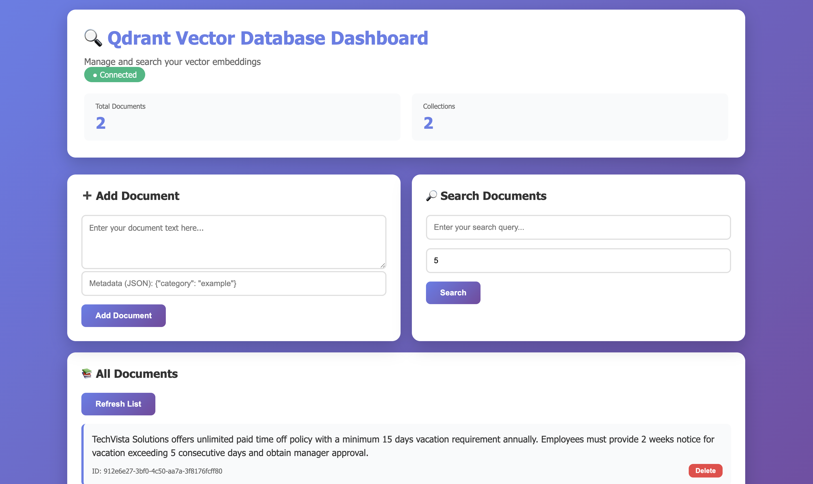
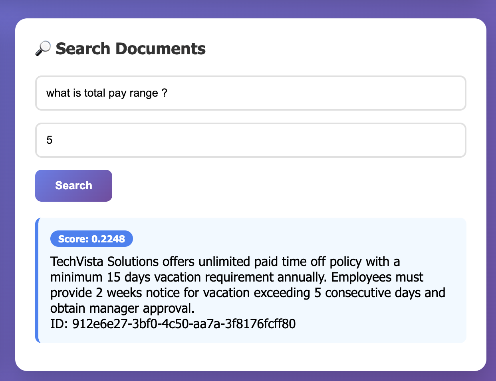
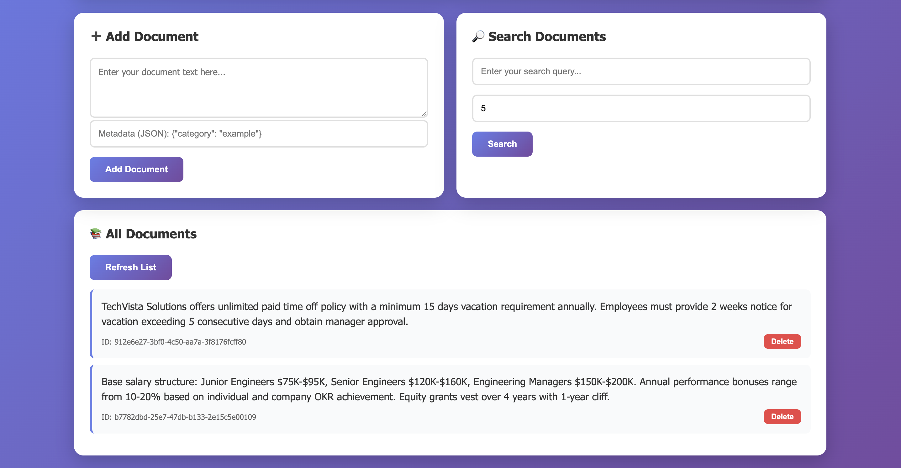

# Qdrant Vector Search Platform

[](https://opensource.org/licenses/MIT)
[](https://www.python.org/downloads/)
[](https://fastapi.tiangolo.com/)
[](https://qdrant.tech/)

A production-ready, full-stack semantic search platform powered by Qdrant vector database, FastAPI backend, and a modern web UI. Build intelligent search applications with natural language understanding out of the box.

## 🖼️ Screenshots

### Web Dashboard

*Modern, intuitive web interface for managing documents and performing semantic searches*

### Search Interface

*Powerful semantic search with real-time results and similarity scores*

### Document Management

*Easy document management with metadata support and visual feedback*

## 🛠️ Tech Stack

- **Backend:** FastAPI, Python 3.11, Sentence Transformers
- **Database:** Qdrant Vector Database
- **Frontend:** Vanilla JavaScript, Modern CSS
- **Server:** Nginx
- **Deployment:** Docker, Docker Compose
- **ML Model:** all-MiniLM-L6-v2 (384-dim embeddings)

## ✨ Features

- 🔍 **Semantic Search** - Natural language understanding with sentence transformers
- 🎨 **Modern Web UI** - Beautiful dashboard for managing documents and collections
- 🚀 **FastAPI Backend** - High-performance async REST API with auto-generated docs
- 🗄️ **Qdrant Vector DB** - State-of-the-art vector similarity search
- 🐳 **Dockerized** - One-command deployment with docker-compose
- 🔄 **Auto-reload** - Hot reload for development
- 📦 **Collection Management** - Create, delete, and manage multiple collections
- 🎯 **Interactive Management Script** - Smart CLI tool for container management

## 🚀 Quick Start

### 1. Clone & Setup

```bash
git clone https://github.com/kode-mafia008/qdrant-vector-search.git
cd qdrant-vector-search

# Copy environment template
cp .env.example .env
```

### 2. Start Everything

**Option A: Use the management script (recommended)**
```bash
./entryPoint.sh
# Select option 1 to start containers
```

**Option B: Use docker compose directly**
```bash
docker compose up -d
```

### 3. Access the Application

- **Web UI**: http://localhost:3000
- **API Docs (Swagger)**: http://localhost:8000/docs
- **API Docs (ReDoc)**: http://localhost:8000/redoc
- **Qdrant Dashboard**: http://localhost:6333/dashboard

## 📁 Project Structure

```
qdrant-vector-search/
├── .env.example              # Environment variables template
├── .gitignore               # Git ignore rules
├── docker-compose.yaml      # Docker services configuration
├── entryPoint.sh           # Interactive management script
├── LICENSE                 # MIT License
├── README.md              # This file
├── api/                   # FastAPI backend
│   ├── Dockerfile
│   ├── requirements.txt
│   └── main.py           # API endpoints
└── web/                  # Web UI
    ├── Dockerfile
    ├── nginx.conf
    └── index.html       # Dashboard UI
```

## 📦 What's Included

### Services

1. **Qdrant** (port 6333, 6334)
   - Vector database with persistent storage
   - REST and gRPC APIs

2. **FastAPI Backend** (port 8000)
   - Automatic text embedding using `sentence-transformers`
   - REST API for CRUD operations
   - Vector similarity search

3. **Web UI** (port 3000)
   - Beautiful dashboard to manage documents
   - Add documents with metadata
   - Search with similarity scores
   - View and delete documents

## 🎯 Usage Examples

### Using the Web UI

1. Open http://localhost:3000
2. Add a document in the "Add Document" section
3. Search for similar documents using natural language
4. View all documents in the bottom section

### Using the API

```bash
# Add a document
curl -X POST "http://localhost:8000/documents" \
  -H "Content-Type: application/json" \
  -d '{
    "text": "Machine learning is awesome",
    "metadata": {"category": "AI"}
  }'

# Search for similar documents
curl -X POST "http://localhost:8000/search" \
  -H "Content-Type: application/json" \
  -d '{
    "query": "artificial intelligence",
    "limit": 5
  }'

# Get all documents
curl "http://localhost:8000/documents"

# Delete a document
curl -X DELETE "http://localhost:8000/documents/{doc_id}"
```

### Using Python Client

```python
from qdrant_client import QdrantClient

# Connect to Qdrant directly
client = QdrantClient(host="localhost", port=6333)

# List collections
collections = client.get_collections()
print(collections)

# Get collection info
info = client.get_collection("documents")
print(f"Points count: {info.points_count}")
```

## 🔧 API Endpoints

### Document Management
| Method | Endpoint | Description |
|--------|----------|-------------|
| POST | `/documents` | Add document with auto-embedding |
| GET | `/documents` | Get all documents (with pagination) |
| POST | `/search` | Semantic search with similarity scores |
| DELETE | `/documents/{id}` | Delete document by ID |

### Collection Management
| Method | Endpoint | Description |
|--------|----------|-------------|
| GET | `/collections` | List all collections |
| POST | `/collections` | Create new collection |
| GET | `/collections/{name}/info` | Get collection details |
| DELETE | `/collections/{name}` | Delete collection |

### System
| Method | Endpoint | Description |
|--------|----------|-------------|
| GET | `/` | API status |
| GET | `/health` | Health check with collection count |

## 🛠️ Configuration

### Environment Variables

Edit `.env` file to customize ports and settings:

```bash
# Qdrant Configuration
QDRANT__SERVICE__HTTP_PORT=6333
QDRANT__SERVICE__GRPC_PORT=6334
QDRANT_HOST=qdrant
QDRANT_PORT=6333

# Application Ports
API_PORT=8000
WEB_PORT=3000
QDRANT_HTTP_PORT=6333
QDRANT_GRPC_PORT=6334
```

### Change Embedding Model

Edit `api/main.py`:

```python
# Default: all-MiniLM-L6-v2 (384 dimensions, fast)
model = SentenceTransformer('all-MiniLM-L6-v2')

# For better quality (slower):
# model = SentenceTransformer('all-mpnet-base-v2')  # 768 dimensions
```

### Persistent Storage

Data is stored in `./qdrant_storage/` and persists across restarts.

## 📊 Monitoring

### View Logs

```bash
# All services
docker-compose logs -f

# Specific service
docker-compose logs -f qdrant
docker-compose logs -f api
```

### Qdrant Dashboard

Visit http://localhost:6333/dashboard to see:
- Collections
- Points count
- Memory usage
- API metrics

## 🧪 Testing

```bash
# Test API health
curl http://localhost:8000/health

# Check Qdrant
curl http://localhost:6333/collections

# Add sample data
curl -X POST "http://localhost:8000/documents" \
  -H "Content-Type: application/json" \
  -d '{"text": "Hello world", "metadata": {"test": true}}'
```

## 🔄 Management Commands

### Using the Interactive Script (Recommended)

```bash
./entryPoint.sh
```

The script provides an interactive menu with:
- ✅ Start/Stop containers based on current state
- 🔄 Restart services
- 📋 View logs (per service or all)
- 🔨 Rebuild containers from scratch
- 🌐 Open service URLs in browser
- 💚 Health check with JSON output
- 📊 Real-time container status

### Using Docker Compose Directly

```bash
# Stop all services
docker compose down

# Restart services
docker compose restart

# View running containers
docker compose ps

# View logs
docker compose logs -f api

# Remove everything (including data)
docker compose down -v
rm -rf qdrant_storage/

# Rebuild after code changes
docker compose build
docker compose up -d
```

## 🚀 Migration to Qdrant Cloud

When ready to move to production:

1. Sign up at https://cloud.qdrant.io
2. Create a cluster
3. Update API connection:

```python
# In api/main.py
client = QdrantClient(
    url="https://your-cluster.cloud.qdrant.io",
    api_key="your-api-key"
)
```

No code changes needed - same API!

## 🐛 Troubleshooting

### API Can't Connect to Qdrant

```bash
# Check if Qdrant is running
docker-compose ps

# Restart Qdrant
docker-compose restart qdrant

# Check logs
docker-compose logs qdrant
```

### Web UI Shows "Disconnected"

- Make sure all services are running: `docker-compose ps`
- Check API logs: `docker-compose logs api`
- Verify ports aren't in use: `lsof -i :8000,3000,6333`

### Port Already in Use

Edit `docker-compose.yml` and change ports:
```yaml
ports:
  - "8001:8000"  # Change 8000 to 8001
```

## 📚 Resources

- [Qdrant Docs](https://qdrant.tech/documentation/)
- [FastAPI Docs](https://fastapi.tiangolo.com/)
- [Sentence Transformers](https://www.sbert.net/)

## 🎨 Creating Custom Collections

You can create collections with different vector sizes and distance metrics:

```bash
# Create a collection for different embedding model
curl -X POST "http://localhost:8000/collections" \
  -H "Content-Type: application/json" \
  -d '{
    "name": "my_custom_collection",
    "vector_size": 768,
    "distance": "Cosine"
  }'
```

**Distance Metrics:**
- `Cosine` - Best for normalized vectors (default)
- `Euclid` - Euclidean distance
- `Dot` - Dot product similarity

## 💡 Use Cases

- 📚 **Document Search** - Semantic search across documentation
- 🛍️ **Product Recommendations** - Find similar products
- 💬 **Chatbot Knowledge Base** - Retrieve relevant context
- 🎵 **Content Discovery** - Similar articles, songs, videos
- 🔍 **Duplicate Detection** - Find similar content
- 📊 **Customer Support** - Match tickets to solutions

## 🤝 Contributing

Contributions are welcome! Please feel free to submit a Pull Request.

1. Fork the repository
2. Create your feature branch (`git checkout -b feature/AmazingFeature`)
3. Commit your changes (`git commit -m 'Add some AmazingFeature'`)
4. Push to the branch (`git push origin feature/AmazingFeature`)
5. Open a Pull Request

## 📄 License

This project is licensed under the MIT License - see the [LICENSE](LICENSE) file for details.

## 🙏 Acknowledgments

- [Qdrant](https://qdrant.tech/) - Vector similarity search engine
- [FastAPI](https://fastapi.tiangolo.com/) - Modern Python web framework
- [Sentence Transformers](https://www.sbert.net/) - State-of-the-art sentence embeddings

## 📞 Support

- 📖 [Documentation](https://qdrant.tech/documentation/)
- 💬 [Qdrant Discord](https://discord.gg/qdrant)
- 🐛 [Issues](https://github.com/kode-mafia008/qdrant-vector-search/issues)

---

**Made with ❤️ using Qdrant, FastAPI, and Docker**